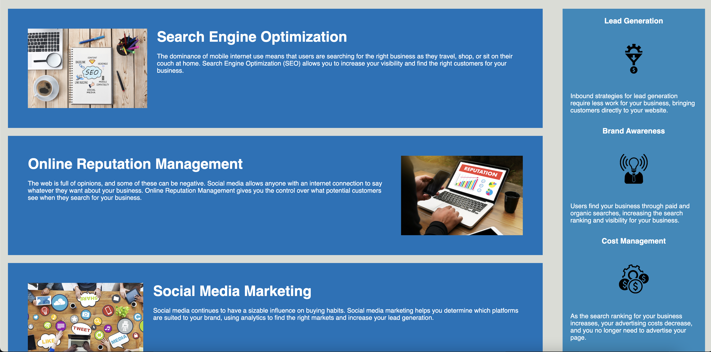
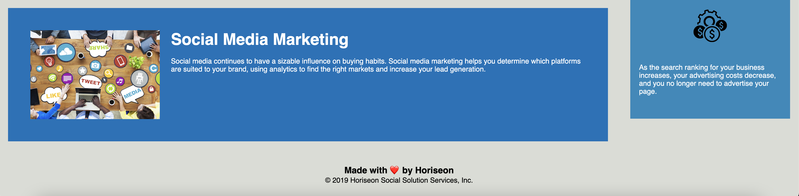

# Marketing With Horiseon

## Table Of Content

- [Description](#Description)
- [Visuals](#Visuals)
- [Usage](#Usage)
- [Links](#Links)
- [Aurthors-and-Acknowledgement](#Authors-and-Acknowledgment)

### Description

Made several tweaks to this site such as fixed the anchor for Seo link in nav bar. Resized and optimized images for faster loading times. This site has hover elements from attributes in css. Have updated this site to look and feel more readable for the end user.

### Visuals

  
  

### Usage

This Site is used to learn about Seo and marketing and is an example of a basic site for a Company.

### Links

[Repo](https://github.com/FatherWolf/seo-refactor-project)  
[Horiseon-site](https://fatherwolf.github.io/seo-refactor-project/)

### Authors-and-Acknowledgement

Made with ❤️️ by Horiseon
© 2019 Horiseon Social Solution Services, Inc.
